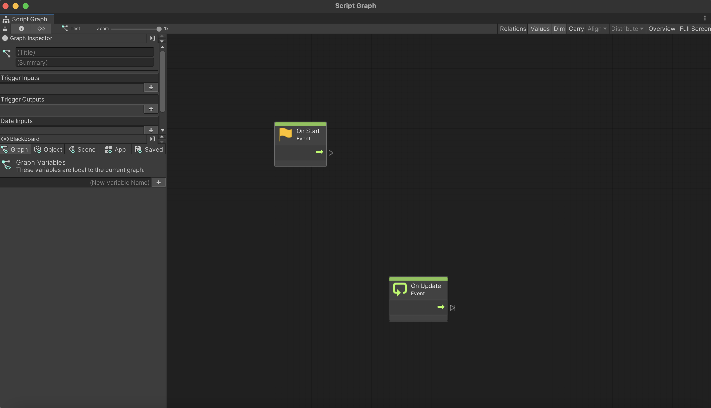
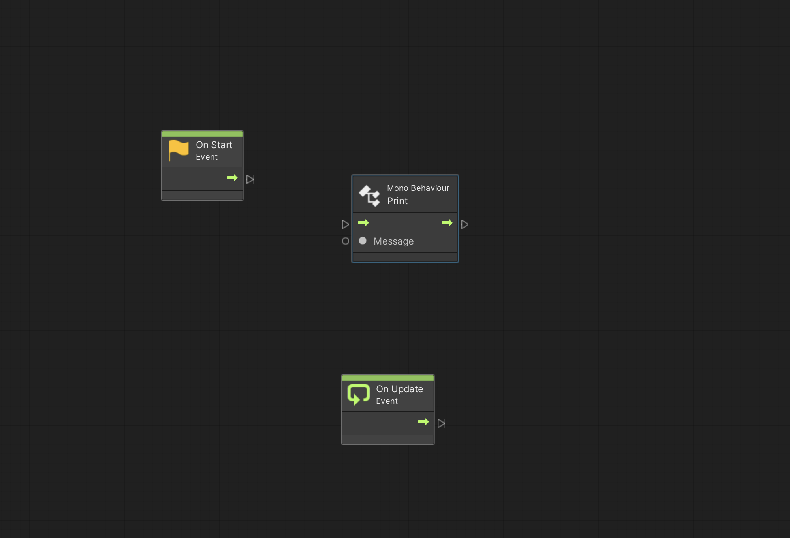
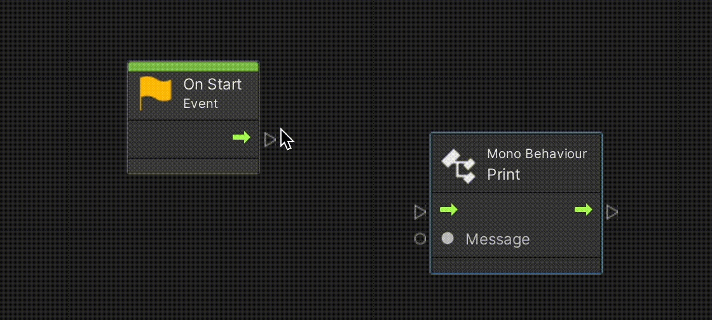
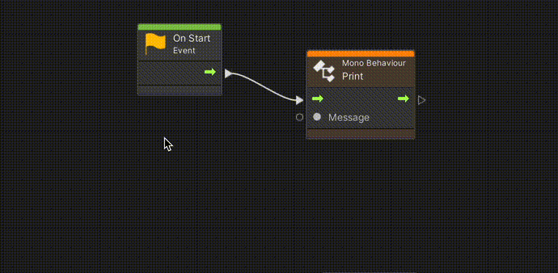
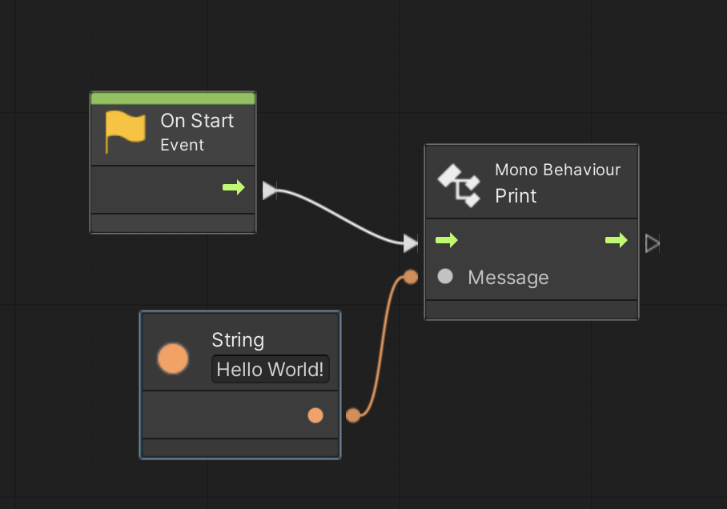

# Part 2: Graphs, Nodes, and Flow

## Machines and Graphs

In visual scripting, **graphs** are where the game logic lives. On the other hand, a **machine** is what actually runs a graph. 

In order to start with visual scripting, we will have to create a graph and a machine. For now, we'll focus on one type in particular: **script** graphs and **script** machines. This is likely the type you'll use the most.

### Setting up a Machine and Graph

To make a script machine, create a gameObject in your scene and add the "Script Machine" component to it. 

The purpose of a Script Machine is simply to run a Scripting Graph. Of course, it first needs to be given a graph to run. Do this by choosing the "source." You have two options.
- **Embed**: Use a graph that lives on this gameObject.
- **Graph**: Use a graph that lives independently of any specific gameObject/scene.

There are benefits and drawbacks to both choices.

**Embed**: An embedded graph lives on a specific gameObject in your scene. It can access all the gameObjects in the scene, and their components.

**Graph**: If you don't embed your graph, it will exist independently of your scene. As a result, it won't have access to gameObjects in the scene. This is good if you want to avoid strongly coupling your graph to your gameObject, or if you want to use it in multiple places.

For now, let's make an embedded graph. When we select "Embed" as a source, an embedded graph will be auto-created for us.

At this point, you can click "Edit Graph," and start scripting!

## Basics of a Graph

When you open your graph, you'll see something like this.

There's a fair amount  here, but for now, let's  focus on the main panel. There's a graph with two nodes already present: **Start** and **Update**.

If you've used C# with Unity before, these should be very familiar. **Start** runs once at the beginning of a graph's life cycle, and **Update** runs every frame.

Let's connect some nodes to these and see what happens.

### Hello World

Let's start with a simple print statement.

Right-click the main panel to open the node creation menu. Search for the "Print" node, and then select it to add it to the graph. 

Of course, this Print node doesn't know when to run or what to print yet. Let's solve the former problem by creating logical flow from the Start node to the Print node. Do that by connecting their green arrows together.

Technically, this logical flow is just a special type of data, called - appropriately enough - "Flow." The Start node outputs it, and then the Print node takes it as input. If we wanted something to happen after our print, then we'd connect the Print node's output with the next node's Flow input.

The Print node is still missing an input: the actual message to display. To fix this, let's add a String Literal node.

In the String Literal node's text field, type in the message you want. Then connect it with the Message input on the Print node. The final result should look like this: 

Exit the graph window, and play the scene. If all goes according to plan, you should see "Hello World!" show up on the console.

## Moving Forward

If you got the above example to work, then you already understand the fundamentals of visual scripting in Unity.

At this point, the best thing you can do is experiment. Search around in the node creation menu and see how different kinds of nodes work. Experiment with a longer or more complex web of nodes. Try doing some math calculations!

## Notes
- You can also make a scripting graph by right-clicking in your project view and choosing Create > Visual Scripting > Script Graph. However, while you'll be able to edit this graph, it won't do anything unless you have a Script Machine reference it.

## References

https://docs.unity3d.com/Packages/com.unity.visualscripting@1.7/manual/vs-graph-machine-types.html