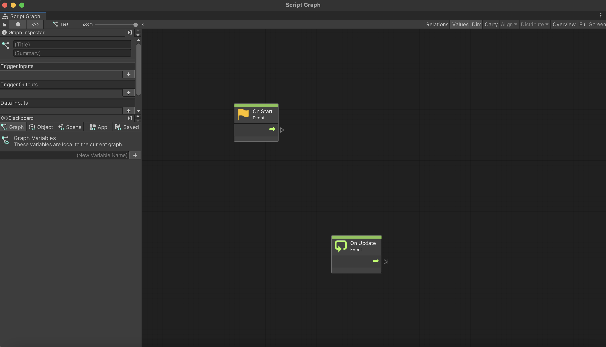

# Part 2: Graphs, Nodes, and Flow

## Machines and Graphs

In visual scripting, **graphs** are where the game logic lives. On the other hand, a **machine** is what actually runs a graph. 

In order to start with visual scripting, we will have to create a graph and a machine. For now, we'll focus on one type in particular: **script** graphs and **script** machines. This is likely the type you'll use the most.

### Setting up Script Machines / Graphs

To make a script machine, create a gameObject in your scene and add the "Script Machine" component to it. 

The purpose of a Script Machine is simply to run a Scripting Graph. Of course, it first needs to be given a graph to run. Do this by choosing the "source." You have two options.
- **Embed**: Use a graph that lives on this gameObject.
- **Graph**: Use a graph that lives independently of any specific gameObject/scene.

There are benefits and drawbacks to both choices.

**Embed**: An embedded graph lives on a specific gameObject in your scene. It can access all the gameObjects in the scene, and their components.

**Graph**: If you don't embed your graph, it will exist independently of your scene. As a result, it won't have access to gameObjects in the scene. This is good if you want to avoid strongly coupling your graph to your gameObject, or if you want to use it in multiple places.

For now, let's make an embedded graph. When we select "Embed" as a source, an embedded graph will be auto-created for us.

At this point, you can click "Edit Graph"

**Notes**: 
- You can also make a scripting graph by right-clicking in your project view and choosing Create > Visual Scripting > Script Graph. However, while you'll be able to edit this graph, it won't do anything unless you make a Script Machine reference it.