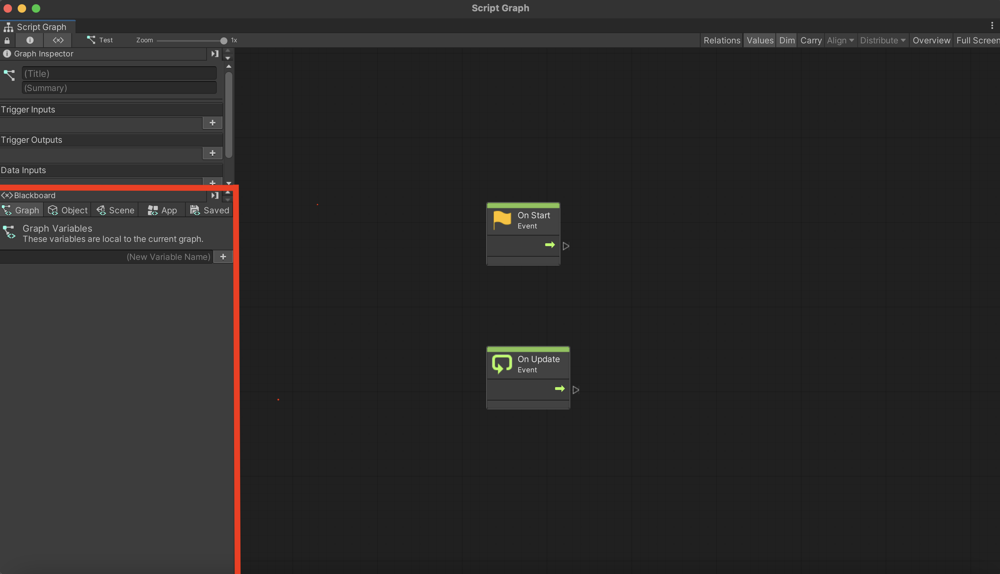

# Part 3: The Blackboard

**Contents**: [Variable Scopes](#variable-scopes) | [Creating and Using Blackboard Variables](#creating-and-using-blackboard-variables) | [Blackboard Variables in Action](#blackboard-variables-in-action) | [Blackboard Variables in C#](#blackboard-variables-in-c)

Sometimes, it's useful to store variables for reuse. The Blackboard - the panel on the bottom left of the graph view - makes this possible in visual scripting.

## Variable Scopes

The Blackboard lets you save variables in five scopes.

**Graph**: Available in the current graph.

**Object**: Available for any graph on the current gameObject. 
- Unembedded graphs can access an object-scope variable. However, the graph must be connected to a machine component on the relevant gameObject.

**Scene**: Available for any graph in the current scene.
- Unembedded graphs can access a scene-scope variable. However, the graph must be connected to a machine component on some gameObject in the scene.

**App**: Available for any graph. Resets when the game finishes running.

**Saved**: Available for any graph. Doesn't reset when the game finishes running.
- Under the tab for saved variables, you can access both the original value of the variables (from before the first save), and the current saved values.
- The "Save Variables" node saves the variables in this scope as they currently are.

## Creating and Using Blackboard Variables

To create a variable, simply pick the appropriate scope, type in the name of the variable, and then press the '+' icon.

You can now access the variable with three nodes: Get, Set, and Has Variable. Has Variable determines whether the variable has received a value or not.

For convenience, you can drag a variable from the Blackboard to the graph to make a Get (Variable Name) node.

## Blackboard Variables in Action

### A Simpler Example

Consider this graph. Note the Blackboard variable called "MysteryNumber" with an initial value of 10.

What is happening here? Pay attention to the flow.
- The "Start" node flows into the "Set Variable" node right away.
- The "Set Variable" node sets MysteryNumber to the product of 5 and MysteryNumber itself.
- Then, MysteryNumber is printed.

So, when you run the game, the number 50 should show up on the console. And it does!

### A More Complex Example

Let's try something more difficult.

Consider this graph. Note the Blackboard variable called "CurrentSum" with an initial value of 0.

This graph introduces the For Loop node.

What does that do? It sets a special number called the index to **First**. Then, it runs **Body** repeatedly, increasing the index by **Step** with each re-run. Finally, when the index goes beyond **Last**, it finishes and runs **Exit**.

With that in mind, what's happening here?  To break it down, pay attention to the flow.

- The Start node flows into the For Loop node right away.
- The For Loop node sets its index to 0, and then runs the body repeatedly, increasing the index by 1 with each re-run.
- In the body, CurrentSum's value is set to the sum of the index and itself. In other words, it's increased by the index value.
- Finally, when the index goes beyond 100, the For Loop runs the exit.

So, what's happening here?

If you said it's summing up all the numbers between 0 and 100, you're correct! The Print node at the end displays that exact number (4950).

If you're unconfident about that fact, try to follow the flow yourself, as if you're Unity running the code.

If you understand this example, your understanding of Blackboard variables is in a very good place.

## Blackboard Variables in C#

Unity.VisualScripting provides a class called `Variables` which lets you access Blackboard variables from a C# script. You can learn more about it [here](https://docs.unity3d.com/Packages/com.unity.visualscripting@1.7/manual/vs-variables-reference.html).

## References:

https://docs.unity3d.com/Packages/com.unity.visualscripting@1.7/manual/vs-variables.html

https://docs.unity3d.com/Packages/com.unity.visualscripting@1.7/manual/vs-variables-reference.html