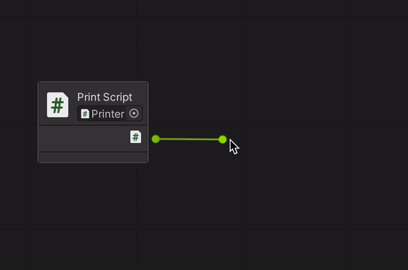

# Part 4: Connecting Visual Scripting with C#

**Contents**: [Motivation](#motivation) | [Calling a C# Script From a Graph](#calling-a-c-script-from-a-graph) | [Moving Forward](#moving-forward)

## Motivation

As mentioned in [Part 0](0_WhyVisualScripting.md), there are several good reasons to avoid **exclusively** using visual scripting for a game. 
- Visual scripting runs much slower than C# code.
- Sometimes, it's simpler to express logic through C# code than through visual scripting.
- In general, it's good practice to separate lower-level operations from higher-level operations.

Fortunately, we can call C# scripts from our visual scripting graphs--and the process is very similar to what we already covered in [Part 2](2_GraphsNodesAndFlow.md).

## Calling a C# Script From a Graph

Let's work with a very simple C# script, called PrintScript, whose only purpose is to print text.

```
using System.Collections;
using System.Collections.Generic;
using UnityEngine;

public class PrintScript : MonoBehaviour
{
    public void PrintMessage(string message)
    {
        print(message);
    }
}
```

Note that it's important for PrintMessage() to be public; otherwise, our graph wouldn't be able to call the method!

Make a new empty gameObject called "Printer," and add the script as a component.

Now, we need to make a graph that can access this script. **Recall that embedded graphs have access to their gameObject's components.** Because of that, we should make an embedded graph on the same gameObject as our script.
- (Note: Technically, an unembedded graph could also work--if you stored the PrintScript instance as a Blackboard variable.)

At this point, edit the graph and right-click to open the node creation menu. Search for "PrintScript"...

**...except you likely won't find anything.**

Why? When you make a new C# script, the visual scripting system doesn't necessarily know about it yet. To fix this, you need to refresh its understanding of the current scripts that are available.

Go to Edit > Project Settings > Visual Scripting. You should see something like this.


Click **Regenerate Nodes** to update your visual scripting nodes so they reflect your current C# code.

Then, return to the graph editor and the search "PrintScript" in the node creation menu again. This time, it should appear!

Create a PrintScript literal node. Your graph should look like this.


The node doesn't know *which* PrintScript it's dealing with, yet. Fix this by pressing the button to the right of where it says "None." One PrintScript instance should be available: the one attached to your gameObject, which your graph knows about since it's embedded!


Now, we have access to any public method or field in that instance of PrintScript! Let's tell it to run PrintMessage().



Finally, tell PrintMessage what to print and when to run. This should be familiar from [Part 2](2_GraphsNodesAndFlow.md).


Play the game, and you should see that message show up in the console!


## Moving Forward

By calling C# code from our graphs, we can nicely hide lower-level logic from our higher-level graphs.

In the next section, we'll talk about another way to separate high-level logic with low-level logic: **nesting graphs in other graphs**.

## Next Lesson

[Part 5: Nesting Graphs](5_NestingGraphs.md)