# Part 5: Nesting Graphs

*Contents*: [Introduction](#introduction) | [Subgraphs: Representing Graphs as Nodes](#subgraphs--representing-graphs-as-nodes) | [Creating and Using a Subgraph](#creating-and-using-a-subgraph) | [Inputting and Outputting Data with a Subgraph](#inputting-and-outputting-data-with-a-subgraph) | [Conclusion](#conclusion)

## Introduction

(This introduction is mainly for non-coders. If you're familiar with good coding practices, you may want to skip to the next section.)

Programmers tend to avoid large blocks of code. Instead, they prefer to separate it into smaller functions. See the following pseudocode:

```
void getJuice() {
    while not at fridge:
        leftFoot.rise();
        leftFoot.moveForward();
        leftFoot.hitGround();
        rightFoot.rise();
        rightFoot.moveForward();
        rightFoot.hitGround();
    
    grabFridgeHandle();
    openFridge;
    locate(juice);
    grab(juice);
    open(juice);
    pour(juice);
}

void getWater() {
    while not at fridge:
        leftFoot.rise();
        leftFoot.moveForward();
        leftFoot.hitGround();
        rightFoot.rise();
        rightFoot.moveForward();
        rightFoot.hitGround();
    
    grabFridgeHandle();
    openFridge();
    locate(water);
    grab(water);
    open(water);
    pour(water);
}
```

There's a lot of nasty code repetition here, and it's also a bit hard to read since the actions are so specific.

Let's fix this by moving the low-level logic somewhere else.

```
void getJuice() {
    goToFridge();
    getAndPour(juice);
}

void getWater() {
    goToFridge();
    getAndPour(water)
}
```

This code is much nicer; there aren't so many details to look at anymore. In addition, there's one universal place that handles going to the fridge: the goToFridge() function. Compare that with the previous code, where that logic was repeated twice--once in getJuice() and once in getWater().

Can we do something similar for visual scripting? It turns out that we can!

## Subgraphs: Representing Graphs As Nodes

You can represent an entire graph as a node in another graph. A "smaller" graph as a node within a "larger" graph is called a **subgraph**.

Subgraphs are useful when you have large blocks of logic you want to hide or reuse.

Consider the following graph from [Part 3](3_TheBlackBoard.md). Recall that it sums up all the numbers between 0 and 100.


Imagine that, afterward, we wanted to sum up the numbers between 0 and 50, and then the numbers between 0 and 30. What are our options?

Of course, we can simply copy and paste all our nodes two more times, like so:

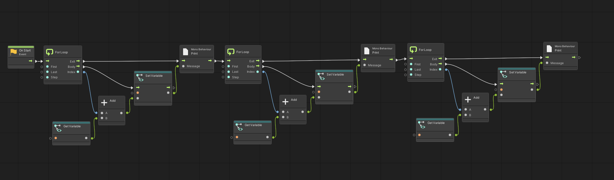

Then, in the second and third for loops, we'd simply change "Last" to 50 and 30.

This is clearly wasteful, though. Why duplicate logic when you can put it all in one place for reuse?

A better alternative would be to create a subgraph. How can we do that?

## Creating and Using a Subgraph

Open the node creation menu, and search for "Subgraph." The resulting node should look like this.

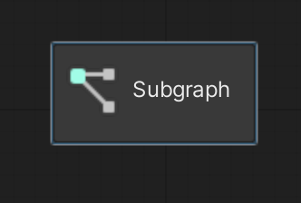

Click on the Subgraph node, and take a look at the Node Inspector on the top left. There, we can create a new graph.

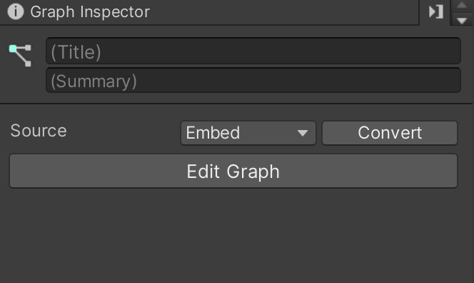

Note how similar the interface is to that of the Script Machine component. We can either make an embedded graph (in this case, embedded in this *graph*, not the gameObject), or we can reference a graph file.
- Note that we *cannot* reference a graph that's embedded in a gameObject.

Let's stick with the embedded option, and give our subgraph the title "SumIntegersUpTo." Click "Edit Graph." The resulting interface should look like this:

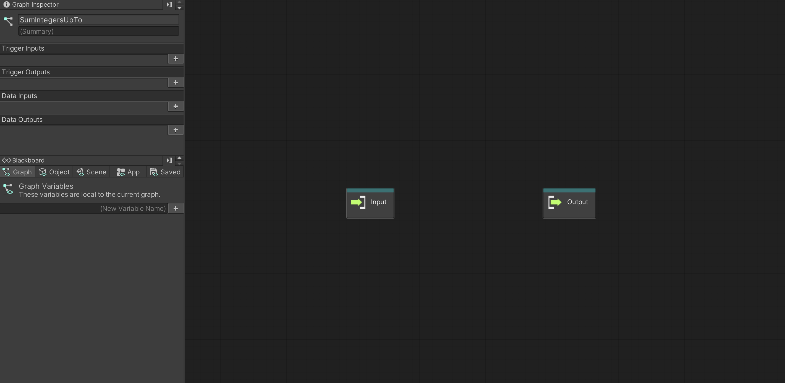

The interface here is slightly different from a "regular" graph. For one thing, we now have an input node and an output node. These define how the higher-level graph will interact with this subgraph.

In the graph inspector, we see that we can add Trigger Inputs, Trigger Outputs, Data Inputs, and Data Outputs.

- **Trigger Inputs**: Allow logical flow from the high-level graph into this graph.
- **Trigger Outputs**: Allow logical flow from this graph into the high-level graph.
- **Data Inputs**: Allow the high-level graph to send data to this graph.
- **Data Outputs**: Allow this graph to send data to the high-level graph.

What kinds of inputs do we want for a subgraph that sums up any number from 0 to 100... or 0 to 50... or 0 to 30?

Well, we definitely want at least one trigger input and one trigger output, so logic can flow in and out of this graph. Let's call these "Start" and "Finish."

When we create these, we get to decide the "Key" and "Label" for both. The key is a unique identifier for the input/output, and the label is the name that you'll see when editing the graph.

When you add the trigger input and output, your graph should look like this:

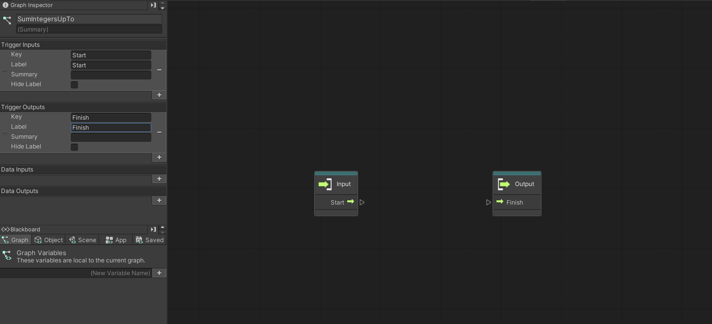

At this point, we can move our for loop logic from the high-level graph to the subgraph.

After copy-pasting the logic and connecting it with Start and Finish, we end up with this subgraph:

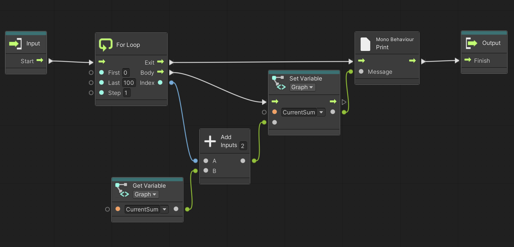

...But something is wrong. Can you spot what it is?

The issue is that we're trying to reference the Blackboard variable "CurrentSum." This is a graph-scope variable originally made in the higher-level graph. Therefore, it belongs to that graph only, so we can't access it here!

We have to make a new Blackboard variable as a replacement--one that we *can* access in the subgraph. Then, we'll need to change the Get and Set nodes to reference *that* variable instead.

Once that's done, we should have a working subgraph! With the for-loop moved, we can simplify the high-level graph to this:

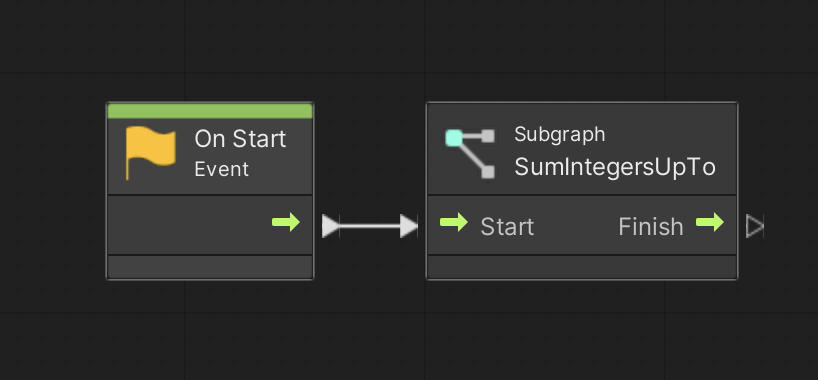

Now, run the game and you should see "4950" appear in the console, just like with the original graph in Part 3!

This subgraph still leaves a bit to be desired, though.

## Inputting and Outputting Data with a Subgraph

Our subgraph still has two core issues:
- What if we want to sum up to a number different from 100?
- What if we want to do more than print the result?

Both of these problems can be solved with data inputs/outputs.
- We can have a data input which defines the top index of our for loop.
- We can have a data output for our sum, so we can pass that value to the higher level graph.

With that in mind, let's add these to the graph inspector:

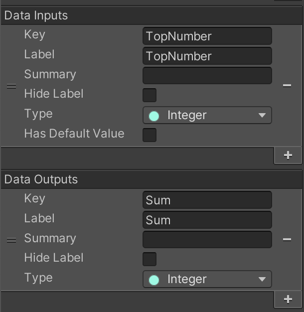

When we add those, our input and output nodes will change as follows.

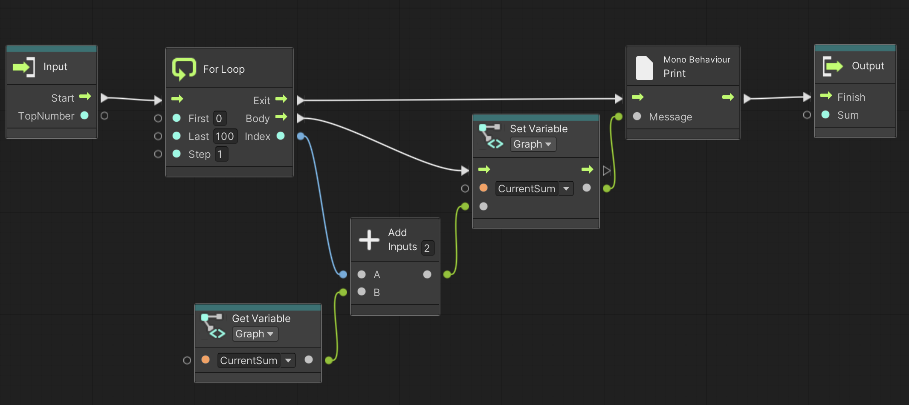

Now, all we have to do is integrate those values into the graph, like so:

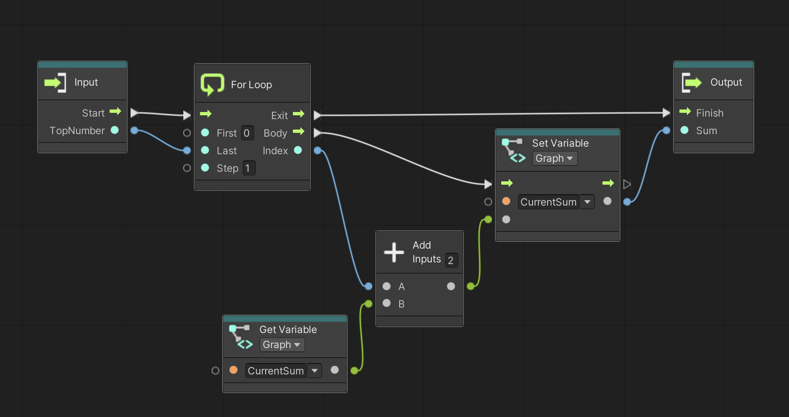

If we look at the high-level graph again, we can see that the SumIntegersUpTo node looks a little different.

Let's provide it with input we need, and then print its output, just to make sure everything is still working as expected.

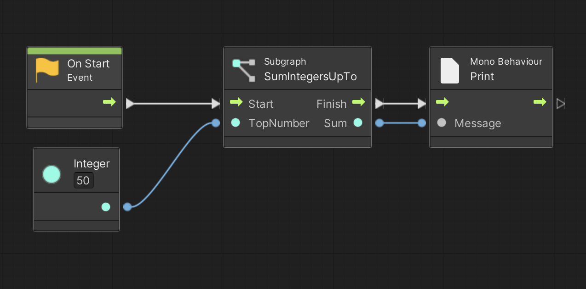

Run the game and you should see 1225 in the console -- the sum of all numbers from 0 to 50!

Finally, let's return to our original goal: summing all numbers from 0 to 100, and then 0 to 50, and then 0 to 30. Doing that is much less complicated now!

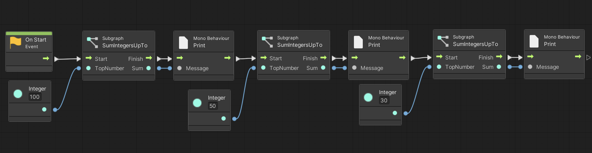

Run the game and see the results print one by one: 4950, 1225, and 435.

## Conclusion

Congratulations! You now know the basics of visual scripting in Unity! 

You should now be well-equipped to get started on projects of your own. 

Advanced tutorials for more niche features, such as representing custom classes as nodes, will likely be added in the future.

## References

https://docs.unity3d.com/Packages/com.unity.visualscripting@1.7/manual/vs-add-subgraph.html
