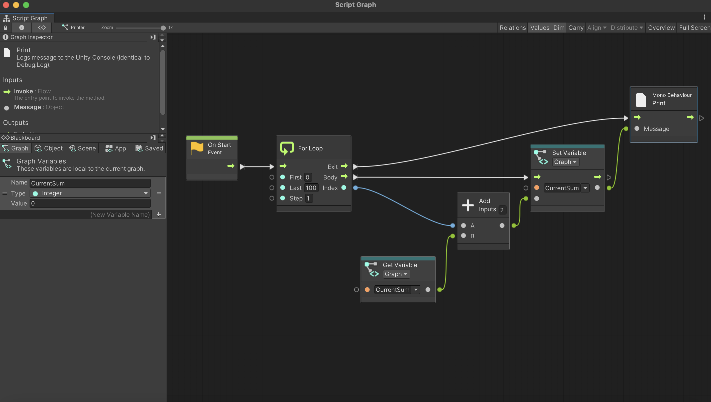

# Part 4: Nesting Graphs

## Introduction 

(The following is mainly for non-coders. If you're familiar with good coding practices, you may want to skip to the "Nodes within Nodes" section.)

Programmers tend to avoid large blocks of code. Instead, they prefer to separate it into smaller functions. See the following pseudocode:

```
void getJuice() {
    while not at fridge:
        leftFoot.rise();
        leftFoot.moveForward();
        leftFoot.hitGround();
        rightFoot.rise();
        rightFoot.moveForward();
        rightFoot.hitGround();
    
    grabFridgeHandle();
    openFridge;
    locate(juice);
    grab(juice);
    open(juice);
    pour(juice);
}

void getWater() {
    while not at fridge:
        leftFoot.rise();
        leftFoot.moveForward();
        leftFoot.hitGround();
        rightFoot.rise();
        rightFoot.moveForward();
        rightFoot.hitGround();
    
    grabFridgeHandle();
    openFridge();
    locate(water);
    grab(water);
    open(water);
    pour(water);
}
```

There's a lot of nasty code repetition here, and it's also a bit hard to read since the actions so specific.

Let's fix this by moving the low-level logic somewhere else.

```
void getJuice() {
    goToFridge();
    getAndPour(juice);
}

void getWater() {
    goToFridge();
    getAndPour(water)
}
```

This code is much nicer; there aren't so many details to look at anymore. In addition, there's one universal place that handles going to the fridge: the goToFridge() function. Compare that with the previous code, where that logic was repeated twice - once in getJuice() and once in getWater().

Can we do something similar for visual scripting? It turns out that we can!

## Nodes Within Nodes

You can represent an entire graph as a node in another graph. A "smaller" graph as a node within a "larger" graph is called a **subgraph**.

Subgraphs are useful when you have large blocks of logic you want to hide or reuse.

Consider the following graph from [Part 3](3_TheBlackBoard.md). Recall that it sums up all the numbers between 0 and 100.


